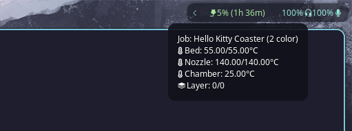

# waybar-printer-status



A simple widget for displaying the Bambu Lab printer status in waybar.

I've tested the widget only with Bambu Lab X1C. There are some differences in the MQTT between Bambu Lab printer models, so the software might not work with other models.

The widget can be used with multiple monitors. Only one instance of the program will handle the MQTT messages; passing it to other instances by unix socket at `/tmp/waybar-bambu-status.sock`.


## 🛠️ Installation (Go Required)
You can install `waybar_bambu_status` directly if you have Go installed:
```bash
go install github.com/jkelanne/waybar_bambu_status@latest
```
The default installation path if `$GOBIN` is not set is `$HOME/go/bin/`
### With path
```bash
export GOBIN=$HOME/.local/bin
go install github.com/jkelanne/waybar_bambu_status@latest
```

## 📦 Option 2: **Manual Build**
Clone and build manually:

```bash
git clone https://github.com/jkelanne/waybar_bambu_status.git
cd waybar_bambu_status
go build -o waybar-bambu-status
```

# Configuration
`$HOME/.config/waybar-bambu-status/config.json`
## Example
Access code and address can be read from the X1C menu `Configuration > General` and `Configuration > Network`. Serial number is not currently used. 
```json
{
	"printer": {
		"access_code": "12345678",
		"serial": "",
		"address": "ssl://192.168.1.123:8883",
		"mqtt_topic": "#",
		"username": "bblp",
		"client_id": "waybar-bambu-status"
	}
}
```

# Waybar configuration
## Add module to waybar
```
    "modules-right": [
        "custom/bambu_status",
    ],
```
## `bambu_status`-module configuration
```json
    "custom/bambu_status" : {
        "exec": "$HOME/bin/waybar_bambu_status",
        "return-type": "json"
    }

```

# Styling
Three classes are used in the styling: `running`, `idle` and `fault` 
```css
#custom-bambu_status.running {
    color: @green;
}

#custom-bambu_status.idle {
    color: alpha(@teal, 0.4);
}

#custom-bambu_status.fault {
    color: @red ;
}
```
